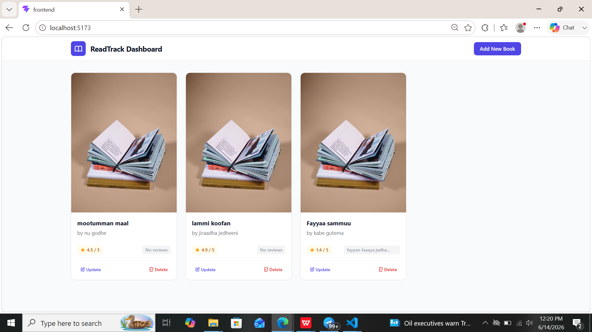
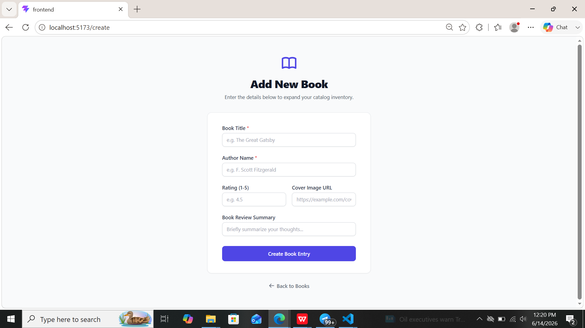
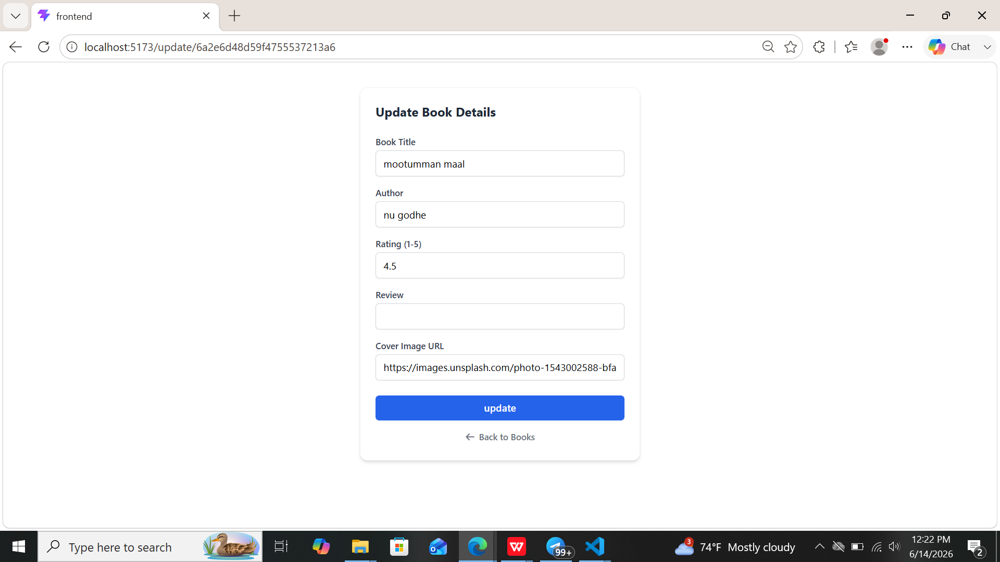

# Read Track 📚

Read Track is a full-stack MERN application designed for avid readers to log, organize, and monitor the books they read. Users can manage their reading history directly through an intuitive dashboard. 

The application features full CRUD capabilities, strict frontend input filtering, and robust backend data schemas to ensure seamless tracking without database type-mismatch errors.

## 🚀 Features

- **Personal Dashboard:** View all tracked books in a clean, organized layout.
- **Full CRUD Management:**
  - **Create:** Log new books with title, author, review, and a cover image.
  - **Read:** Fetch the entire reading list or retrieve individual books by ID.
  - **Update:** Modify existing book entries and reviews dynamically.
  - **Delete:** Remove books permanently from your tracking list.
- **Smart Rating System:** A custom-engineered text input that dynamically blocks invalid characters, restricts lengths to 3 characters, and caps ratings at a maximum of 5.0.
- **Data Sanitization:** Automatically parses frontend strings into floating-point numbers before sending them to the API.

## 📸 Screenshots

> **Note:** To display your screenshots here, take screenshots of your local app, create a folder named `screenshots` in your project's root folder, save the images there as `dashboard.png`, `addform.png`, and `updateform.png`, and they will automatically show up below!

### Main Dashboard View


### Create Book Form


### Update Book Form



## 🛠️ Tech Stack

- **Frontend:** React.js, Tailwind CSS, Axios
- **Backend:** Node.js, Express.js
- **Database:** MongoDB (Mongoose Object Modeling)

---

## 📋 Key Implementation Details

### Data Integrity & Validation Flow

To prevent database type-mismatch errors and crashes, the rating data goes through a strict lifecycle:

1. **User Input Handling (UI):** Uses a customized React state listener coupled with a Regular Expression (`/^(?!0\d)\d?(\.\d?)?$/`) to reject non-numeric inputs dynamically during typing.
2. **Data Parsing:** Converts string values using `parseFloat()` right inside the Axios payload to match MongoDB's expected `Number` schema.
3. **API Integrity:** The API payload transfers data as a pure JSON number structure (`"rating": 4.5`), ensuring it saves perfectly in the database.

---

## 💻 Getting Started

### Prerequisites

Make sure you have Node.js and MongoDB installed and running on your machine.

### Installation & Setup

1. **Clone the repository:**
   First, run the git clone command for https://github.com/injifann/readtrack-mernapp and then navigate into the READTRACK directory.

2. **Set up the backend:**
   Navigate into the backend folder, install the node modules using the npm install command, and start the local environment by running the npm run dev script.

3. **Set up the frontend:**
   Change directories back to the frontend folder, install the necessary user interface packages using npm install, and boot up the development server with npm run dev.

---

## 🌐 API Endpoints

All data fetching and deletions targeting specific records are safely isolated using `req.params` via unique MongoDB Object IDs.

| Method | Endpoint | Description | Payload Example |
| :--- | :--- | :--- | :--- |
| **GET** | `/api/books` | Fetch all books for the dashboard | None |
| **GET** | `/api/books/:id` | Fetch a single book by its ID | None |
| **POST** | `/api/books` | Add a new book to the tracker | `{"title": "...", "rating": 4.5, ...}` |
| **PUT** | `/api/books/:id` | Update an existing book's details | `{"title": "Updated Title", ...}` |
| **DELETE** | `/api/books/:id` | Remove a book via URL parameter ID | None |

### Sample POST/PUT Payload Format:
```json
{
  "title": "The Great Gatsby",
  "author": "F. Scott Fitzgerald",
  "rating": 4.5,
  "review": "An absolute classic.",
  "coverImage": "[https://example.com/image.jpg](https://example.com/image.jpg)"
}